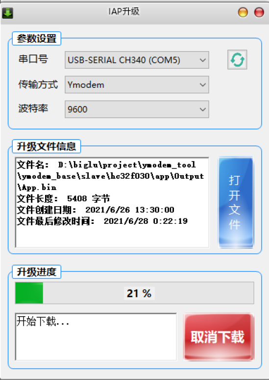

# Ymodem_tool

基于Ymodem协议的串口IAP，下位机适配stm32多个系列、华大hc32f0系列等，上位机基于C#、QT。

## 下位机

### 1. 芯片适配：

- 华大的F0系列
- ST的G0、F1、F7系列

### 2. 项目简介：

1. ymodem_base：演示了Bootloader中通过Ymodem协议传输文件完成IAP升级

2. ymodem_pro：在IAP_Ymodem_base基础上，增加了串口命令、跳转判断等，即实现无需外部触发可重复下载等功能。

## 上位机

## To Do:

- C#上位机的下载流程说明 （2022.4）
