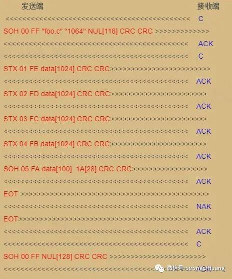
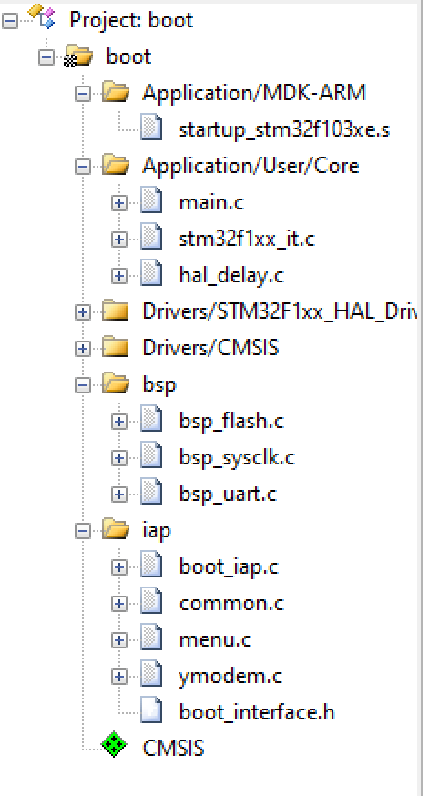
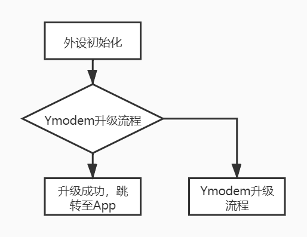
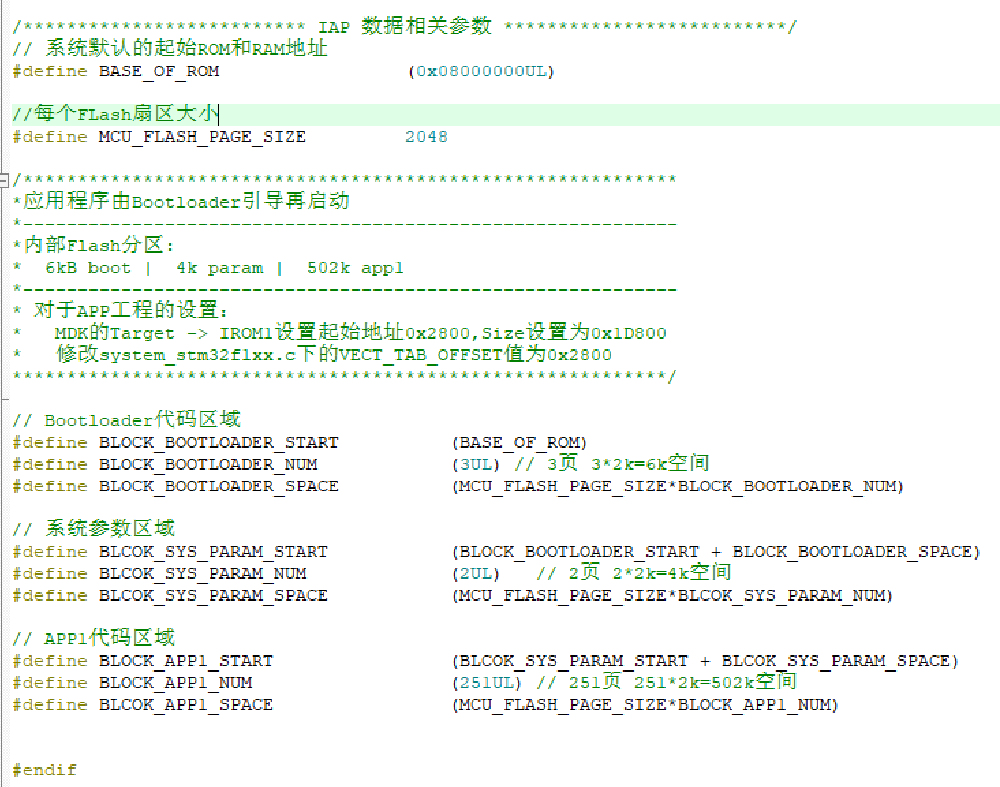
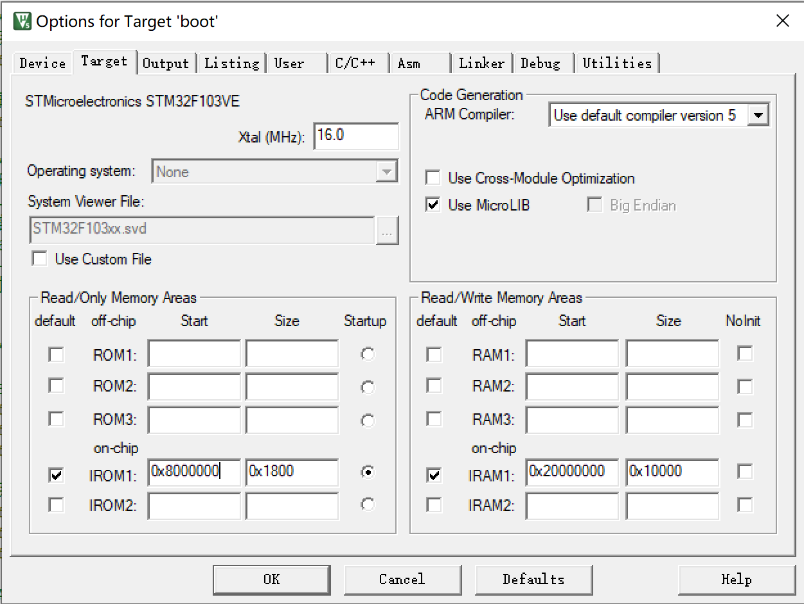
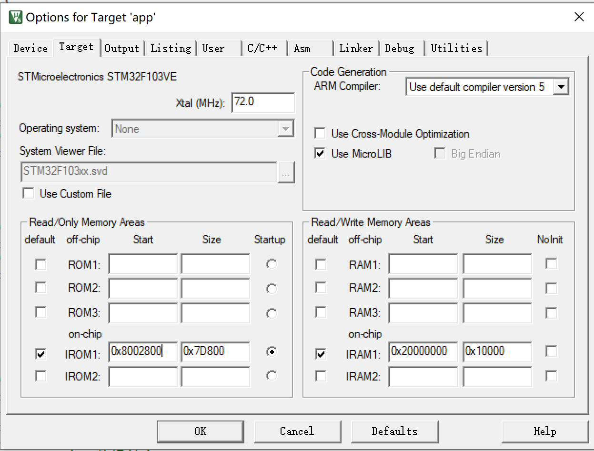

# IAP_Ymodem_base移植说明

IAP_Ymodem_base工程每次使用前需先烧录Bootloader代码。

该工程演示了Bootloader中通过Ymodem协议传输文件完成IAP升级。

## 一、Ymodem协议

Ymodem协议是一种发送并等待的协议，即发送方发送一个数据包以后，都要等待接收方的确认。如果是ACK新号，则发送方可以发送新的包。如果是NAK信号，则重发或者错误退出。

### 协议传输流程：

| 字符  | ASCII码16进制 |
| ----- | ------------- |
| `SOH` | `0x01`        |
| `STX` | `0x02`        |
| `ACK` | `0x06`        |
| `NAK` | `0x15`        |
| `EOT` | `0x04`        |
| `C`   | `0x43`        |

**1.起始帧**

SOH + 00 + FF + filename + filesize + NULL + CRCH + CRCL

起始帧是文件传输发送端发的第一条重要消息.

filename表示传输文件的文件名.

filesize表示需要传输文件的大小.

CRCH + CRCL 表示整条帧(去掉前三个字节)的CRC16校验.

**2.数据帧格式**

STX/SOH + [编号] + 编号的反码 + data[0] + data[1] + data[2] + … + CRCH + CRCL

SOH 表示有128个字节, 有的也只用SOH传输数据.

STX 表示有1024个字节.

CRCH + CRCL 表示整条帧(去掉前三个字节)的CRC16校验.

如果传输最后一条字节不足128个字节, 则用1A填充

**3.结束帧的数据格式**

SOH + 00 + FF + NULL + NULL + … + NULL + CRCH + CRCL

## 二、工程实现

### 2.1 代码组成

1. MDK-ARM文件夹：启动文件。

2. Core文件夹：延时和主函数文件。

3. STM32F1xx_HAL_Driver文件夹：ST的HAL库文件。

4. bsp文件夹：外设驱动文件。

5. iap文件夹：IAP相关文件。

   common.c : 提供串口输出、数据转换等函数。

   menu.c : IAP文件下载的实现。

   ymodem.c : 协议交互的具体实现。

   boot_iap.c : IAP跳转、软复位实现。

   boot_interface.h : IAP参数配置页，根据功能和FLASH裁剪分区大小。

### 2.2 实现流程

## 三、Bootloader程序移植

1. 串口外设的发送和接收实现。

   串口发送函数uart_send，在common.c中用到。

   串口接收函数uart_receive，在ymodem.c中用到。

2. Flash外设的擦、写实现。

3. Flash分区设置。

   根据实际需要，划分Flash分区大小。

4. 工程设置。

   ROM起始地址设置为0x8000000，大小设置为之前分配给Bootloader区域的6K，即0x1800。

## 四、App程序移植

1. 工程设置。

   ROM起始地址设置为App起始Flash地址0x8002800，大小设置为之前分配给Bootloader区域的502K，即0x7D800。

2. 跳转设置。

system_stm32f1xx.c文件中，将偏移地址变量设置为App分区的起始地址。

