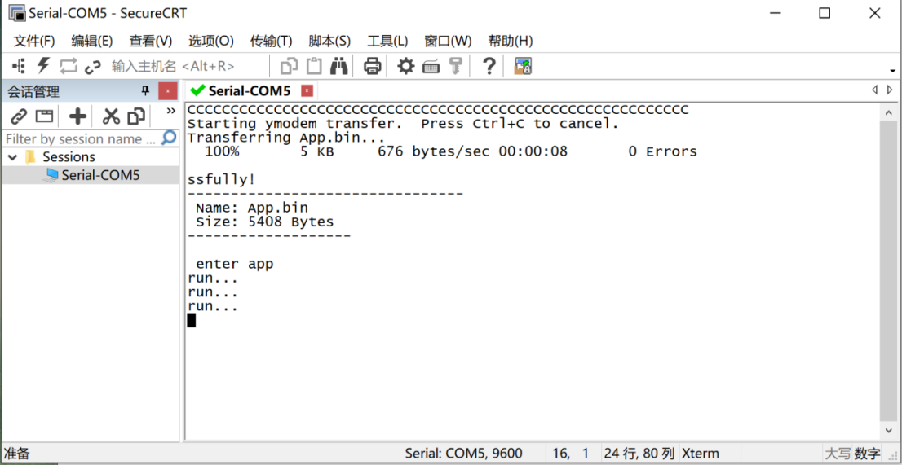

# IAP_Ymodem_base使用说明

   IAP_Ymodem_base工程每次使用前需先烧录Bootloader代码。
   
   该工程演示了Bootloader中通过Ymodem协议传输文件完成IAP升级。

## 一、Bootloader烧录

   通过JLINK或STLINK烧录bootloader程序。

## 二、IAP升级（SecureCRT）

1. 新建回合向导 -> 选择端口、波特率设置9600等 -> 连接端口。

2. 可以看到烧录了bootloader后会按一定间隔发送'C'来等待升级。 

3. 选择传输栏下的发送Ymodem。 

4. 点击Add添加app工程目录下的Output目录下的App.bin文件。 

   （App.bin是app程序的二进制文件，用于IAP或OTA升级）
   
   （dest.hex是app和bootloader程序合并后的hex文件，用于离线烧录）

5. 接下来可以看到传输文件的进度，100%完成后会从bootloader跳转至app程序（app中会每个一段时间打印一次run...）。 

## 三、IAP升级（上位机）

1. 打开ymodem_base\master\ymodem_tool\Ymodem_tool\bin\Release目录下的软件ymodem_tool.exe。
2. 选择对应的串口号、波特率，以及传输方式（Ymodem即每包升级数据128字节，Ymodem-1K级每包升级数据1024字节）。
3. 点击“打开文件”，选择打开对应工程目录下\app\Output\App.bin。
4. 点击“开始升级”，等待升级结果。

5. 下载成功后，打开SSCOM可以看到已进入app程序，即每秒打印“run...”。

## 三、生产输出烧录文件

   在批量生产中，一般使用离线烧录器将HEX文件烧录到芯片中，然后后续的程序通过IAP或OTA接收新的bin文件来更新程序。为了方便生产，在完成app程序后，需要将app程序的hex文件和bootloader的hex文件合并得到一个最终的hex文件，这样在生产时只需要烧录一次程序即可。

1. 设置bootloader工程
   工程目录下的Resource目录下有个MergeHEX.bat文件，该文件用于工程编译后自动合并和转移中间文件最终输出生产文件。
   第一行的作用：调用MDK自带的fromelf.exe工具，将编译后的axf文件转为bin文件，放到resource目录下。
   第二行的作用：将编译后的hex文件，放到resource目录下，以方便将该文件复制到app工程下。

   编写好bat文件后，在MDK工程中设置Target的USER一栏下的AfterBuild，增加调用编译后使用自定义bat文件的功能。

2. 设置app工程
   工程目录下的Resource目录下有个MergeHEX.bat文件，该文件用于工程编译后自动合并和转移中间文件最终输出生产文件。
   第一行的作用：调用MDK自带的fromelf.exe工具，将编译后的axf文件转为bin文件，放到resource目录下。
   第二行的作用：将编译后的hex文件，与bootloader的hex文件通过"mergehex.exe"工具合并，最后放到Output目录下。
   工程目录下的Output目录下的App.bin即app工程的bin文件，dest.hex即app和bootloader合并后的hex文件。

   编写好bat文件后，在MDK工程中设置Target的USER一栏下的AfterBuild，增加调用编译后使用自定义bat文件的功能。

## 四、其他说明

1. 为了节省空间，最终工程采用-03设置。如果想要在线仿真调试，应该减小优化等级设置。
