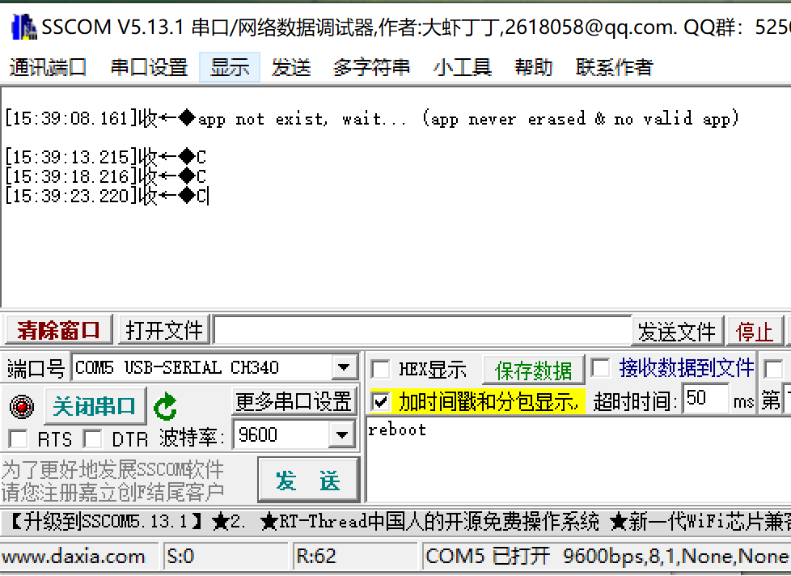
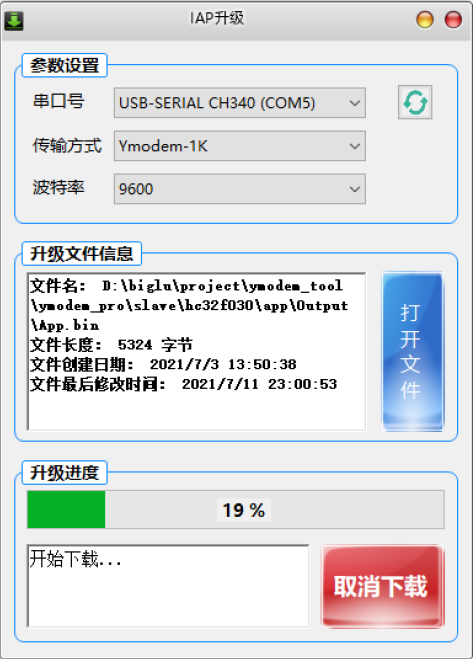
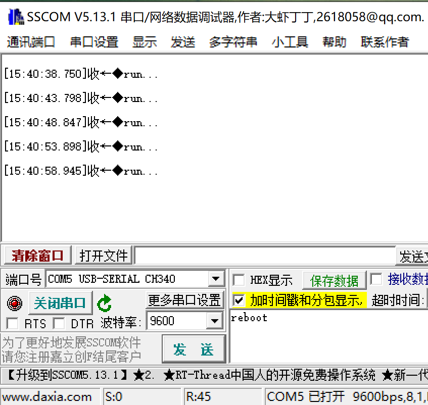
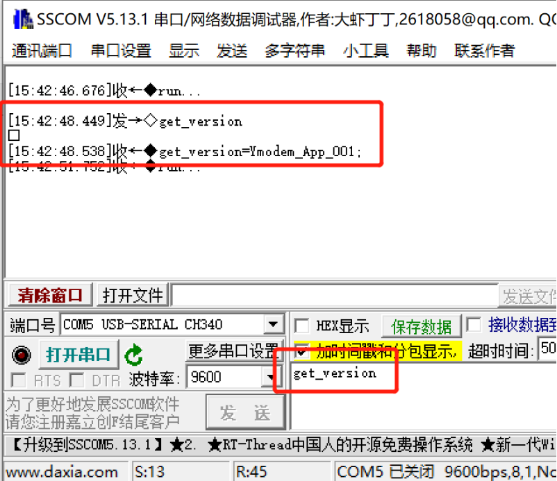
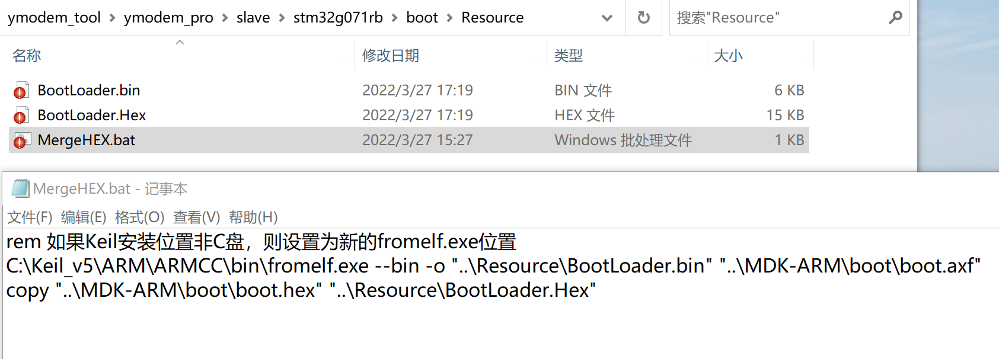
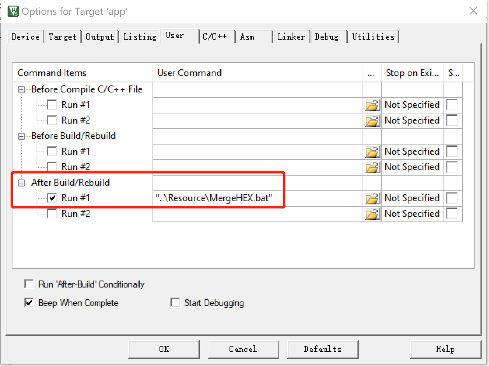
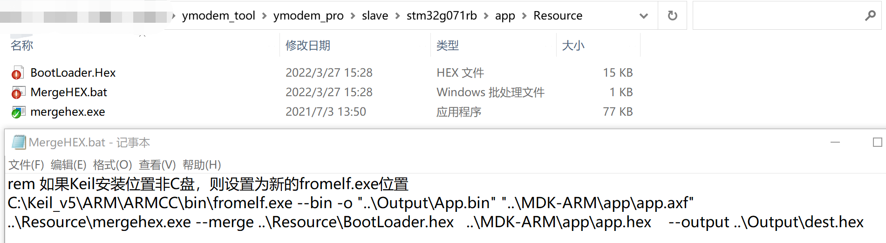

# IAP_Ymodem_pro使用说明

   IAP_Ymodem_pro工程第一次使用前需先烧录Bootloader代码，后续使用时无需再烧录Bootloader代码，可重复下载。
   
   该工程在IAP_Ymodem_base基础上，增加了串口命令、跳转判断等，即实现无需外部触发可重复下载等功能。因为加了自定义串口命令，所以IAP升级时不再支持SecureCRT，只支持上位机。

## 一、Bootloader烧录

   通过JLINK或STLINK烧录bootloader程序。

## 二、IAP升级（上位机）

1. 打开SSCOM，因为此时只烧录了Bootloader程序，所以上电后并没有检测到app程序，并且也没有收到升级命令，则进入Ymdoem升级等待，即每隔一段时间发送字母C。

   

2. 打开ymodem_pro\master\ymodem_tool\Ymodem_tool\bin\Release目录下的软件ymodem_tool.exe。

3. 选择对应的串口号、波特率，以及传输方式（Ymodem即每包升级数据128字节，Ymodem-1K级每包升级数据1024字节）。

4. 点击“打开文件”，选择打开对应工程目录下\app\Output\App.bin。

5. 点击“开始升级”，等待升级结果。

6. 下载成功后，打开SSCOM可以看到已进入app程序，即每秒打印“run...”。

7. 可以发送串口命令“get_version”来获取版本信息，用于测试是否升级成功：先升级一次app，然后更改app工程下的system_config.h中的软硬件版本，再升级一次app，则可验证升级结果。

## 三、生产输出烧录文件

   在批量生产中，一般使用离线烧录器将HEX文件烧录到芯片中，然后后续的程序通过IAP或OTA接收新的bin文件来更新程序。为了方便生产，在完成app程序后，需要将app程序的hex文件和bootloader的hex文件合并得到一个最终的hex文件，这样在生产时只需要烧录一次程序即可。

1. 设置bootloader工程
   工程目录下的Resource目录下有个MergeHEX.bat文件，该文件用于工程编译后自动合并和转移中间文件最终输出生产文件。
   第一行的作用：调用MDK自带的fromelf.exe工具，将编译后的axf文件转为bin文件，放到resource目录下。
   第二行的作用：将编译后的hex文件，放到resource目录下，以方便将该文件复制到app工程下。

   编写好bat文件后，在MDK工程中设置Target的USER一栏下的AfterBuild，增加调用编译后使用自定义bat文件的功能。

2. 设置app工程
   工程目录下的Resource目录下有个MergeHEX.bat文件，该文件用于工程编译后自动合并和转移中间文件最终输出生产文件。
   第一行的作用：调用MDK自带的fromelf.exe工具，将编译后的axf文件转为bin文件，放到resource目录下。
   第二行的作用：将编译后的hex文件，与bootloader的hex文件通过"mergehex.exe"工具合并，最后放到Output目录下。
   工程目录下的Output目录下的App.bin即app工程的bin文件，dest.hex即app和bootloader合并后的hex文件。

   编写好bat文件后，在MDK工程中设置Target的USER一栏下的AfterBuild，增加调用编译后使用自定义bat文件的功能。

## 四、其他说明

1. 为了节省空间，最终工程采用-03设置。如果想要在线仿真调试，应该减小优化等级设置。
